# Chrome Extension for Sonatype Nexus IQ

## Table of Contents

-   [Purpose](#purpose)
-   [Documentation](#Documentation)
-   [Data](#data)
-   [Usage](#usage)
-   [Examples](#examples)
-   [Installation](#installation)
-   [Contributing](#contributing)
-   [Fine Print](#The-Fine-Print)

## Purpose

To allow you to inspect a package before you download it. The plugin requires a valid [Sonatype Lifecycle](https://www.sonatype.com/nexus-lifecycle) instance, or you can use Sonatype's OSS Index for free if you do not have access to a licensed installation of [Sonatype Lifecycle](https://www.sonatype.com/nexus-lifecycle).

## Package Ecosystem Support

The plugin works on the following open source registry sites.

**NOTE:** For the initial versions of 2.x.x, support for OSS Index has been removed (so we could ship quicker!) We'll update
here when support is re-introduced.

| Registry            | Language Group      | URL                             | Sonatype Lifecycle | Sonatype OSS Index |
| ------------------- | ------------------- | ------------------------------- | ------------------ | ------------------ |
| Alpine Linux        | Alpine Linux        | `https://pkgs.alpinelinux.org/` | ✅                 | ❌                 |
| CocoaPods           | Swift / Objective-C | `https://cocoapods.org/`        | ✅                 | ❌                 |
| CRAN                | R                   | `https://cran.r-project.org`    | ✅                 | ❌                 |
| Maven Central       | Java                | `https://central.sonatype.com/` | ✅                 | ✅                 |
| Maven Central (old) | Java                | `https://search.maven.org/`     | ✅                 | ✅                 |
| MVN Repository      | Java                | `https://mvnrepository.com/`    | ✅                 | ✅                 |
| NPM JS              | Javascript          | `https://www.npmjs.com/`        | ✅                 | ✅                 |
| NuGet Gallery       | .NET                | `https://www.nuget.org/`        | ✅                 | ✅                 |
| Packagist           | PHP                 | `https://packagist.org/`        | ✅                 | ✅                 |
| PyPI                | Python              | `https://pypi.org/`             | ✅                 | ✅                 |
| RubGems             | Ruby                | `https://rubygems.org/`         | ✅                 | ✅                 |

6. Conan – C/C++ – `https://conan.io/center/`
7. Conda – Python – `https://anaconda.org/anaconda/`
8. Debian – Linux – `https://packages.debian.org/`
9. Debian – Linux – `https://tracker.debian.org/pkg/`
10. Golang – Go – `https://search.gocenter.io/`
11. Java – Maven – `https://repo.maven.apache.org/`
12. Java – Maven – `https://repo.spring.io/list/`
13. Java – Maven – `https://repo1.maven.org/`
14. Rust – Crates – `https://crates.io/`
15. Nexus Proxy Repos – supported repository formats are maven2, npm, rubygems and nuget e.g. `http://nexus:8081/#browse/browse:maven–central:commons–collections%2Fcommons–collections%2F3.2.1`
16. Artifactory Proxy Repos – supported repository formats are maven2 and npm e.g. `https://artifactory-server/webapp/#/artifacts/browse/tree/General/npmjs–cache/parseurl/–/parseurl–1.0.1.tgz`
17. Artifactory Repo lists – e.g. `https://repo.spring.io/list/jcenter–cache/org/cloudfoundry/cf–maven–plugin/1.1.3/`

## Development

We use node, yarn, React and webpack.

To get started developing:

-   clone the repo
-   `yarn`
-   `yarn build`

You can run `yarn test` as well to ensure everything is setup correctly!

All source code is in `src/` and follows a fairly normal React application setup.

## Documentation

[Sonatype Nexus Lifecycle nexus-iq-chrome-extension](https://sonatype-nexus-community.github.io/nexus-iq-chrome-extension/)

## Data

**NOTE:** For the initial versions of 2.x.x, support for OSS Index has been removed (so we could ship quicker!) We'll update
here when support is re-introduced.

The data is sourced from Sonatype Nexus Lifecycle's IQ Server, which accesses the Sonatype Data Services for those supported ecosystems. For some repositories e.g. Chocolatey, the extension gets its data from Sonatype OSSIndex ( https://ossindex.sonatype.org/ ).

## Usage

When you browse to a website that is covered by the tool, such as Maven Central and click on the plugin, it will open with the Sonatype Lifecycle data relevant to that library. 

### Main icon

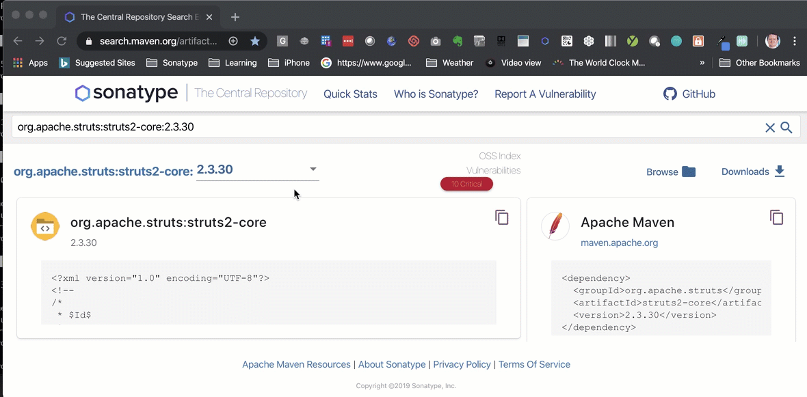
 

### Remediation Guidance

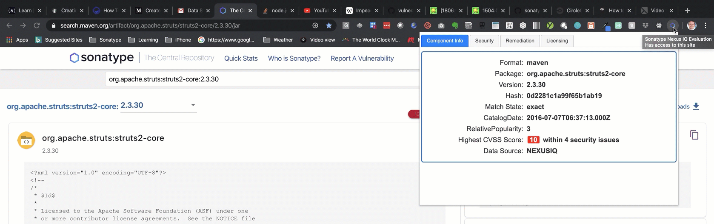

1. The install will create a new icon in your Chrome Browser next to the location box.
   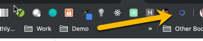
    
2. The plugin will work on any page that matches the URL list above.
    
3. Navigate to one of the pages that the extension is compatible with (see the detailed list below).
    
4. Click on the blue Sonatype logo... 
   
    
   4.1 ...The solution will think for a second and show the Sonatype hexagon logo while it retrieves the data...Then show the Data. 
   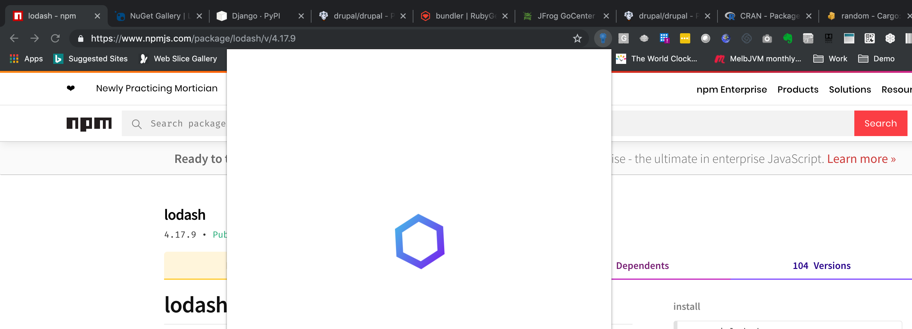
    
5. Component Information 
   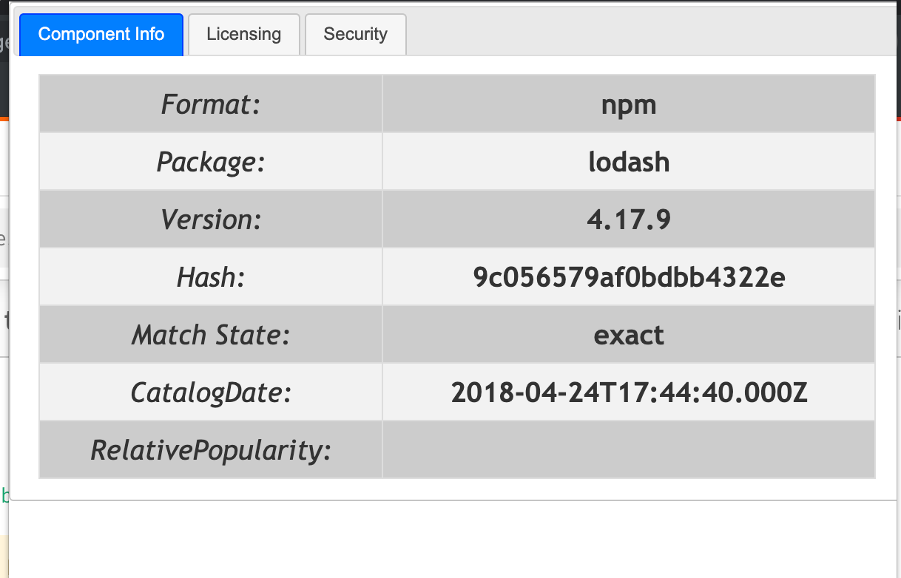
    
6. Security Information 
   The security data is presented in a list with clickable sections for each vulnerability. 
   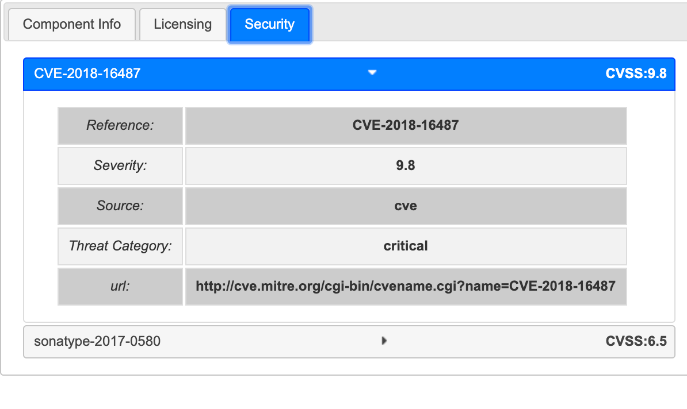
    
7. Security Details 
   The security details for each vulnerability is available. Click on the reference to display the security details. 
   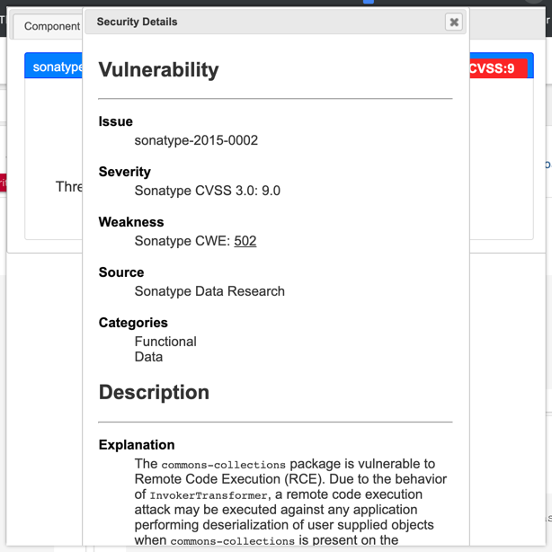
    
8. Remediation 
   The version history is available for each component. 
   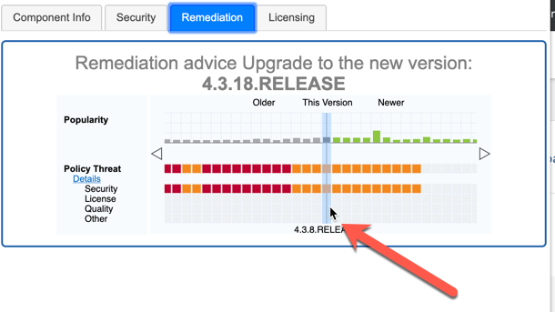
    
9. Remediation Guidance 
   The remediation guidance API has been added. The recommended fix version will be listed at the top of the screen.
    
10. License Information 
    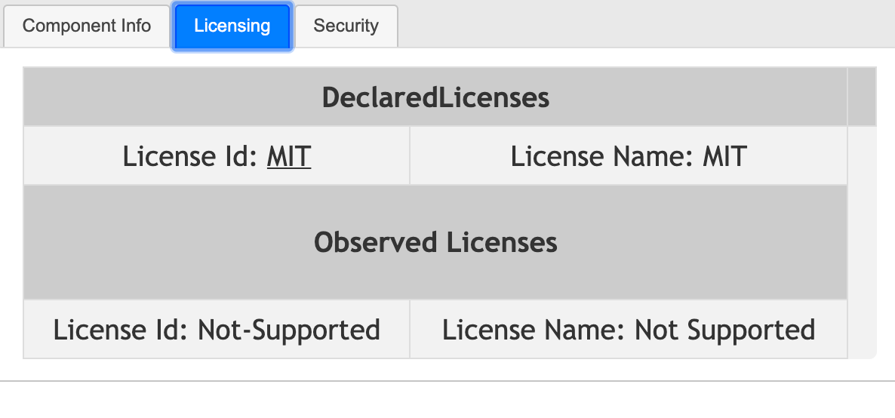
     
11. Unsupported Page 
    If you click on an unsupported page then the following screen will appear.
    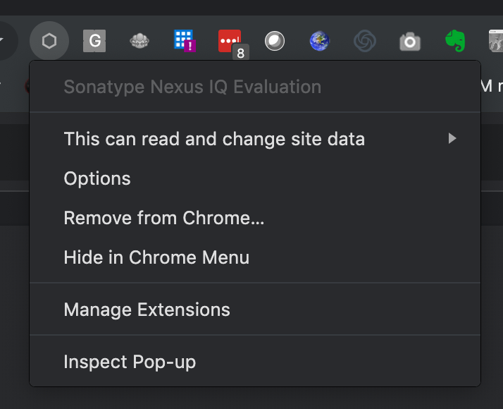
     

## Examples

The list of pages that are supported are here:

1. Alpine – Linux – https://pkgs.alpinelinux.org/
2. Chocolatey – Windows – https://chocolatey.org/
3. Clojars – Clojure – https://clojars.org/
4. Cocoa pods – iOS – https://cocoapods.org/
5. Conan – C/C++ – https://conan.io/center/
6. Conda – Python – https://anaconda.org/anaconda/
7. Debian – Linux – https://packages.debian.org/
8. Debian – Linux – https://tracker.debian.org/pkg/

### dotNet - nuget

Pattern - `https://www.nuget.org/packages/<package>/<version>`
 e.g. <https://www.nuget.org/packages/LibGit2Sharp/0.20.1>

### Github - any language supported by OSSIndex but only supports the releases tag at this stage

<https://github.com/jquery/jquery/releases/tag/1.11.1>

### Golang - Gocenter

`https://search.gocenter.io/`
 e.g. <https://search.gocenter.io/github.com~2Fetcd-io~2Fetcd/versions>

### Java - Maven

Pattern - `https://search.maven.org/artifact/<group>/<artifact>/<version>/<extension>`
 e.g. <https://search.maven.org/artifact/org.apache.struts/struts2-core/2.3.30/jar>

Pattern -`https://mvnrepository.com/artifact/<group>/<artifact>/<version>`
 e.g. <https://mvnrepository.com/artifact/commons-collections/commons-collections/3.2.1>

Pattern - `https://repo1.maven.org/maven2/<group>/<artifact>/<version>/`
  e.g. <https://repo1.maven.org/maven2/commons-collections/commons-collections/3.2.1/>

Pattern - `https://repo.maven.apache.org/maven2/<group>/<artifact>/<version>/`
  e.g. <https://repo.maven.apache.org/maven2/commons-collections/commons-collections/3.2.1/>

### JS/Node - npm

Pattern - `https://www.npmjs.com/package/<package>`
 e.g. <https://www.npmjs.com/package/lodash/>
 and
 Pattern - `https://www.npmjs.com/package/<package>/v/<version>`
 e.g. <https://www.npmjs.com/package/lodash/v/4.17.9>

### PHP - Packagist/Composer

Pattern - `https://packagist.org/`
 e.g. <https://packagist.org/packages/drupal/drupal>

### Ruby - rubygems

Pattern - `https://rubygems.org/gems/<package>`
 e.g. <https://rubygems.org/gems/bundler>

### Python - pypi

Pattern - `https://pypi.org/<package>/`
 e.g. <https://pypi.org/project/Django/>
 or Pattern - `https://pypi.org/<package>/<version>/`
 e.g. <https://pypi.org/project/Django/1.6/>

### R - CRAN

Pattern - `https://cran.r-project.org/`
 e.g. <https://cran.r-project.org/web/packages/A3/index.html>

21. Ruby – RubyGems – https://rubygems.org/

### Rust - Crates

Pattern - `https://crates.io/`
 e.g. <https://crates.io/crates/random>

### NexusRepo - npm, Maven and rubygems

e.g. <http://nexus:8081/#browse/browse:rubygems-proxy:nexus%2F1.4.0%2Fnexus-1.4.0.gem>

## Installation

### Production

1. Install from [Chrome Store](https://chrome.google.com/webstore/detail/mjehedmoboadebjmbmobpedkdgenmlhd/)
2. Click `Add to Chrome`

Note: You will be asked to "Add Sonatype Nexus IQ Extension". Click "Add extension"

3. You will be prompted to enter your login details. (Important: Please note that this version stores your details in plain text in Chrome Storage. We are investigated secure storage but at this time we do not support it. You can use a token for your password though. <https://help.sonatype.com/iqserver/managing/user-management/user-tokens>)
    
   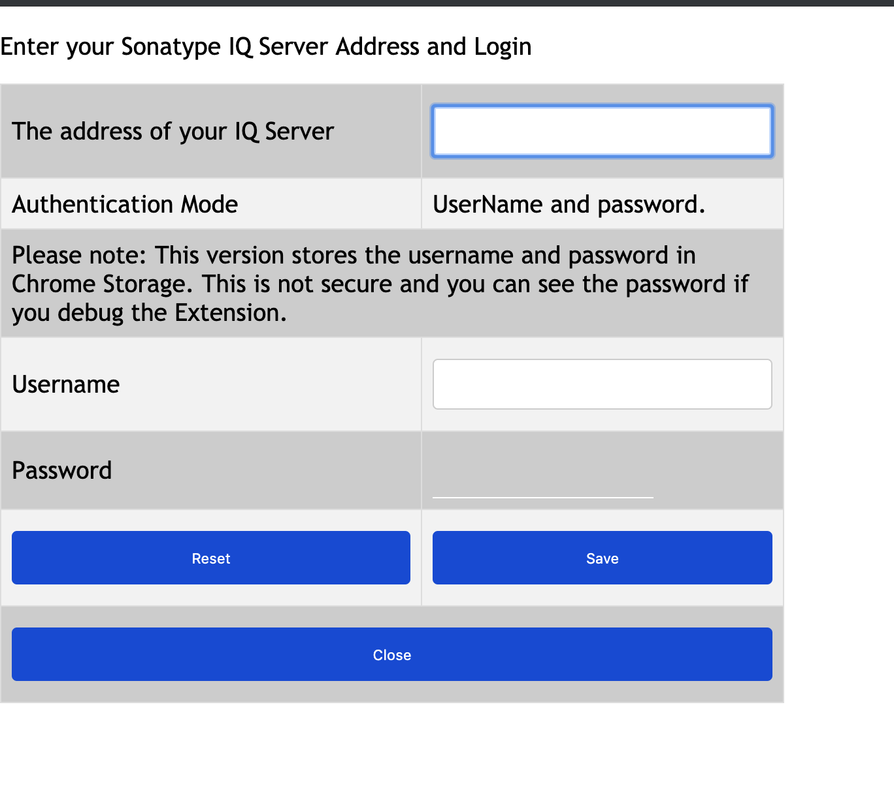
    
4. Select an Application to link to this plugin. The application is required to perform the advanced history and remediation scanning now available.
    
   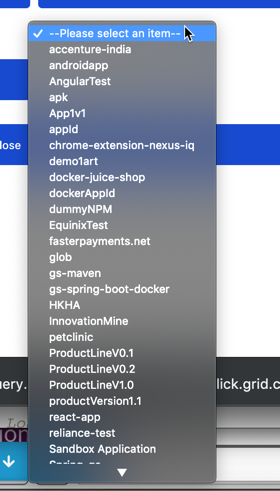
    
5. Click Save to save your credentials.
    
6. You will be advised that your details are saved. Click Close when you are done and You will be taken back to the Extensions Install screen in Chrome. Close the screen and begin using.
7. The installer will have created a new icon in your Chrome Menu Bar.
    
   
    

### Developer mode

1. Download the plugin from GitHub
   `git clone https://github.com/sonatype-nexus-community/nexus-iq-chrome-extension.git`
2. Open Chrome Browser.
3. Click on the three dots, then More Tools, then Extensions.
    
   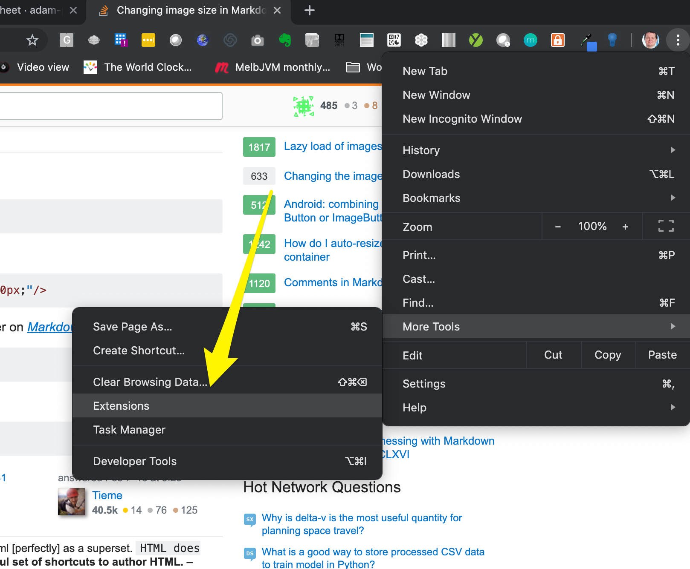
    
4. Click on load unpacked (requires "Developer Mode" to be enabled).
   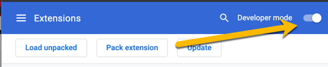
    
   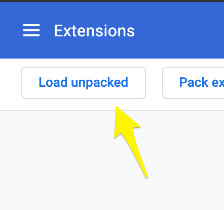
    
5. Navigate to the folder where you downloaded the plugin from GitHub onto your local machine. Select the src subdirectory and then click select
    
   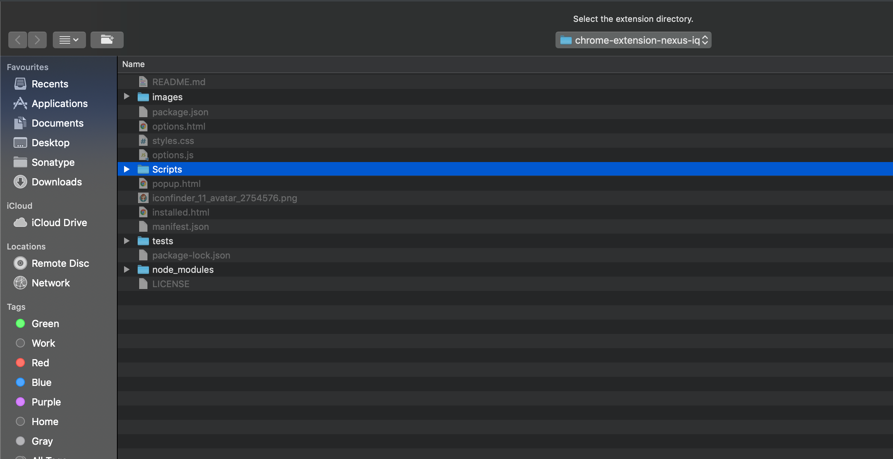
    
6. Configure the plugin like in the Production mode...

### Uninstall

If you do not want to use the extension then you can right click on the icon and choose Remove from Chrome
 
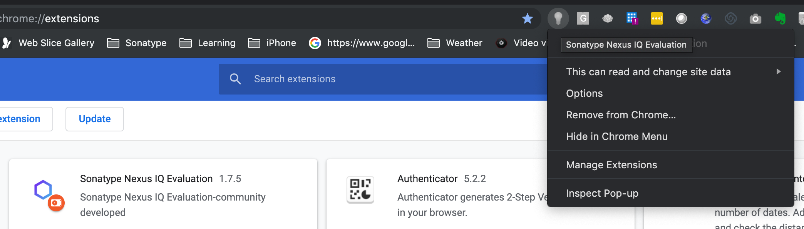
 

### Version History

Go to the [changelog](CHANGELOG.md)

## Contributing

Please read the [Contributing guide](contributing.md)

## The Fine Print

Supported by Sonatype
