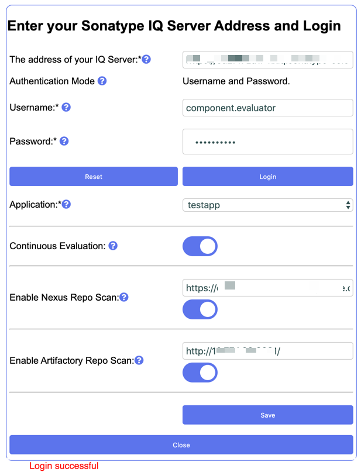

# Chrome Extension for Sonatype Nexexus IQ

## Table of Contents
- [Purpose](#purpose)
- [Data](#data)
- [Usage](#usage)
- [Examples](#examples)
- [Installation](#installation)

## Purpose
To allow you to inspect a package before you download it. The plugin requires a valid Sonatype Nexus Lifecycle instance. You must be licensed to use Nexus lifecycle to use this plugin.
The plugin can scan packages at the following repositories.

1. Java - maven - https://search.maven.org/
2. Java - maven - https://mvnrepository.com/
3. JS/Node - npm - https://www.npmjs.com/
4. .Net - nuget - https://www.nuget.org/
5. Ruby - rubygems - https://rubygems.org/
6. Python - pypi - https://pypi.org/
7. php - packagist/composer/ -  https://packagist.org/
8. R - CRAN -  https://cran.r-project.org/
9. Rust - Crates-  https://crates.io/
10. Golang - Go - https://gocenter.jfrog.com/

## Data
The data is sourced from IQ server which accesses the HDS for those supported ecosystems supported. Currently 1-6. Systems 7-10 get their data from Sonatype OSSIndex ( https://ossindex.sonatype.org/ ).

## Usage
1. The install will create a new icon in your Chrome Browser next to the location box.
 

 

2. The plugin will work on any new page opened after install. It will not work on pages already opened at time of install.

3. Navigate to one of the pages that the extension is compatible with (see the list below).

4. Click on the Blue Lightbulb... 
 

 
4.1 ...The solution will think for a second...Then show the Data.
 

 

5. Component Information

 
6. License Information

 
7. Security Information
The security data is presented in a list with clickable sections for each vulnerbaility.

 

## Examples
The list of pages that are supported are here.

### Java - maven
Pattern - `https://search.maven.org/artifact/<group>/<artifact>/<version>/<extension>`
 e.g. https://search.maven.org/artifact/org.apache.struts/struts2-core/2.3.30/jar
### Java - maven
Pattern -`https://mvnrepository.com/artifact/<group>/<artifact>/<version>`
 e.g. https://mvnrepository.com/artifact/commons-collections/commons-collections/3.2.1
### JS/Node - npm
Pattern - `https://www.npmjs.com/package/<package>`
 e.g. https://www.npmjs.com/package/lodash/
 and
 Pattern - `https://www.npmjs.com/package/<package>/v/<version>`
 e.g. https://www.npmjs.com/package/lodash/v/4.17.9
### DotNet - nuget
Pattern - `https://www.nuget.org/packages/<package>/<version>`
 e.g. https://www.nuget.org/packages/LibGit2Sharp/0.1.0
### Ruby - rubygems
Pattern - `https://rubygems.org/gems/<package>`
 e.g. https://rubygems.org/gems/bundler
### Python - pypi
Pattern - `https://pypi.org/<package>/`
 e.g. https://pypi.org/project/Django/
 or Pattern - `https://pypi.org/<package>/<version>/`
 e.g. https://pypi.org/project/Django/1.6/
### php - packagist/composer/
Pattern - `https://packagist.org/`
 e.g. https://packagist.org/packages/drupal/drupal
### R - CRAN
Pattern - `https://cran.r-project.org/`
 e.g. https://cran.r-project.org/web/packages/A3/index.html
### Rust - Crates
Pattern - `https://crates.io/`
 e.g. https://crates.io/crates/random
### Golang - Go 
`https://gocenter.jfrog.com`
 e.g. https://gocenter.jfrog.com/github.com~2Fjbenet~2Fgo-random/versions

## Installation
1. Download the plugin from Github
2. Open Chrome Browser
3. Click on the three dots, then More Tools, then Extensions
 

 
4. Click on load unpacked
 

 
5. Navigate to the folder where you downloaded the plugin fro gihub onto your local machine.
 

 
6. You will be prompted to enter your login details. (Important: Please not that this version stores your details in plain text in Chrome Storage. We are investigated secure storage but at this time we do not support it.)
 

 
7. Enter your delays and click save.
 

 
7. You will be advised that your details are saved, and the screen will close. You will be taken back to the Extensions Install screen in Chrome. Close the screen and begin using.
8. The installer will have created a new icon in your Chrome Menu Bar.
 

 

### Uninstall
If you do not want to use the extension then you can right click on the icon and choose Remove from Chrome
 

 

### Version History
#### Version 1.7.5
* Added README.md

#### Version 1.7.4-Styling
* Styling of User interface

#### Version 1.7.3-All URLS
* Supports running IQ server on any URL
* Fixed various bugs

#### Version 1.7.2-added new formats
* added new formats
* Fixed various bugs
* Added unit tests

##### Formats/package manager pages supported as of 1.7.2
* Java - maven - https://search.maven.org/
* Java - maven - https://mvnrepository.com/
* JS/Node - npm - https://www.npmjs.com/
* .Net - nuget - https://www.nuget.org/
* Ruby - rubygems - https://rubygems.org/
* Python - pypi - https://pypi.org/
* php - packagist/composer/ -  https://packagist.org/
* R - CRAN -  https://cran.r-project.org/
* Rust - Crates-  https://crates.io/
* Golang - Go - https://gocenter.jfrog.com/

#### Version 1.7.1 - Fixed popup
* Fixed popup logic bug. 
* Began adding testing

#### Version 1.7 - initial release
Complete rewrite to fix cookie problem with calling Nexus IQ server.
I have decided the best way to fix the security issues for now is to limit access to http://iq-server:8070. 
So you will have to alias your localhost as iq-server in your /etc/hosts/ file to use this plugin for now.
I will think about a change which gives access to all URLS like so below

Add "*://*/*" to permissions section like so

`"permissions": [
    "*://*/*",
 `   
    
This would then mean you would not need to alias Nexus IQ.

Supports scanning components in the following repos
* https://search.maven.org/
* https://mvnrepository.com/
* https://www.npmjs.com/
* https://www.nuget.org/
* https://rubygems.org/
* https://pypi.org/
* https://packagist.org/
