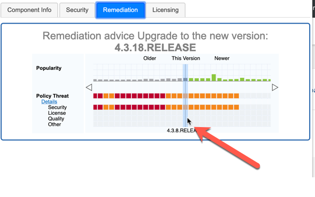

# Chrome Extension for Sonatype Nexus IQ

 

## Table of Contents

- [Purpose](#purpose)
- [Data](#data)
- [Usage](#usage)
- [Examples](#examples)
- [Installation](#installation)
- [Fine Print](#The-Fine-Print)

## Purpose

To allow you to inspect a package before you download it. The plugin requires a valid [Sonatype Nexus Lifecycle](https://www.sonatype.com/nexus-lifecycle) instance, which means you must be licensed to use this plugin.
The plugin can scan packages at the following repositories:

1. Java - maven - https://search.maven.org/
2. Java - maven - https://mvnrepository.com/
3. JS/Node - npm - https://www.npmjs.com/
4. .Net - nuget - https://www.nuget.org/
5. Ruby - rubygems - https://rubygems.org/
6. Python - pypi - https://pypi.org/
7. php - packagist/composer/ - https://packagist.org/
8. R - CRAN - https://cran.r-project.org/
9. Rust - Crates- https://crates.io/
10. Golang - Go - https://search.gocenter.io/
11. Github - any language - https://github.com/jquery/jquery/releases/tag/1.11.1
12. Nexus Proxy Repos - supported repository formats are maven2, npm, rubygems and nuget e.g. http://nexus:8081/#browse/browse:maven-central:commons-collections%2Fcommons-collections%2F3.2.1
13. Artifactory Proxy Repos - supported repository formats are maven2 and npm e.g. https://repo.spring.io/webapp/#/artifacts/browse/tree/General/npmjs-cache/parseurl/-/parseurl-1.0.1.tgz
14. Artifactory Repo lists - e.g. https://repo.spring.io/list/jcenter-cache/org/cloudfoundry/cf-maven-plugin/1.1.3/
15. Maven Repo1 - https://repo1.maven.org/maven2/
16. Maven Repo2 - http://repo.maven.org/maven2/

## Documentation

[Sonatype Nexus Lifecycle nexus-iq-chrome-extension](https://sonatype-nexus-community.github.io/nexus-iq-chrome-extension/)

## Data

The data is sourced from Sonatype Nexus Lifecycle's IQ Server, which accesses the Sonatype Data Services for those supported ecosystems, currently 1-6 & 12-13. Systems 7-11 get their data from Sonatype OSSIndex ( https://ossindex.sonatype.org/ ).

## Usage

When you browse to a website that is covered by the tool, such as maven central and click on the plugin, it will open with the Sonatype Lifecycle data relevant to that library.

 

1. The install will create a new icon in your Chrome Browser next to the location box.
   
    
2. The plugin will work on any page that matches the URL list above.
    
3. Navigate to one of the pages that the extension is compatible with (see the detailed list below).
    
4. Click on the Blue Sonatype Logo...
   
    
   4.1 ...The solution will think for a second and show the Sonatype hexagon log while it retrieves the data...Then show the Data.
   
    
5. Component Information
   
    
6. Security Information
   The security data is presented in a list with clickable sections for each vulnerability.
   
    
7. Security Details
   The security details for each vulnerability is available. Click on the reference to display the security details.
   
    
8. Remediation
   The version history is available for each component.
   
    
9. Remediation Guidance
   The remediation guidance API has been added. The recommended fix version will be listed at the top of the screen.
    
10. License Information
    
     
11. Unsupported page.
    If you click on an unsupported page then the following screen will appear.
    
     

## Examples

The list of pages that are supported are here.

### Java - maven

Pattern - `https://search.maven.org/artifact/<group>/<artifact>/<version>/<extension>`
 e.g. <https://search.maven.org/artifact/org.apache.struts/struts2-core/2.3.30/jar>

Pattern -`https://mvnrepository.com/artifact/<group>/<artifact>/<version>`
 e.g. <https://mvnrepository.com/artifact/commons-collections/commons-collections/3.2.1>

Pattern - `https://repo1.maven.org/maven2/<group>/<artifact>/<version>/`
  e.g. <https://repo1.maven.org/maven2/commons-collections/commons-collections/3.2.1/>

Pattern - `http://repo2.maven.org/maven2/<group>/<artifact>/<version>/`
  e.g. <http://repo2.maven.org/maven2/commons-collections/commons-collections/3.2.1/>

### JS/Node - npm

Pattern - `https://www.npmjs.com/package/<package>`
 e.g. <https://www.npmjs.com/package/lodash/>
 and
 Pattern - `https://www.npmjs.com/package/<package>/v/<version>`
 e.g. <https://www.npmjs.com/package/lodash/v/4.17.9>

### DotNet - nuget

Pattern - `https://www.nuget.org/packages/<package>/<version>`
 e.g. <https://www.nuget.org/packages/LibGit2Sharp/0.20.1>

### Ruby - rubygems

Pattern - `https://rubygems.org/gems/<package>`
 e.g. <https://rubygems.org/gems/bundler>

### Python - pypi

Pattern - `https://pypi.org/<package>/`
 e.g. <https://pypi.org/project/Django/>
 or Pattern - `https://pypi.org/<package>/<version>/`
 e.g. <https://pypi.org/project/Django/1.6/>

### php - packagist/composer/

Pattern - `https://packagist.org/`
 e.g. <https://packagist.org/packages/drupal/drupal>

### R - CRAN

Pattern - `https://cran.r-project.org/`
 e.g. <https://cran.r-project.org/web/packages/A3/index.html>

### Rust - Crates

Pattern - `https://crates.io/`
 e.g. <https://crates.io/crates/random>

### Golang - Gocenter

`https://search.gocenter.io/`
 e.g. <https://search.gocenter.io/github.com~2Fetcd-io~2Fetcd/versions>

### Github - any language supported by OSSIndex but only supports the releases tag at this stage

<https://github.com/jquery/jquery/releases/tag/1.11.1>

### NexusRepo - npm, maven2 and rubygems

e.g. <http://nexus:8081/#browse/browse:rubygems-proxy:nexus%2F1.4.0%2Fnexus-1.4.0.gem>

## Installation

1. Navigate to Chrome store
2. Search for Sonatype

- Link is <https://chrome.google.com/webstore/detail/sonatype-nexus-iq-evaluat/mjehedmoboadebjmbmobpedkdgenmlhd>

3. Click `Add to Chrome`

Note: You will be asked to "Add Sonatype Nexus IQ Extension". Click "Add extension"

4. You will be prompted to enter your login details. (Important: Please note that this version stores your details in plain text in Chrome Storage. We are investigated secure storage but at this time we do not support it. You can use a token for your password though. <https://help.sonatype.com/iqserver/managing/user-management/user-tokens>)
    
   
    
5. Select an Application to link to this plugin. The application is required to perform the advanced history and remediation scanning now available.
    
   
    
6. Click Save to save your credentials.
    

7. You will be advised that your details are saved. Click Close when you are done and You will be taken back to the Extensions Install screen in Chrome. Close the screen and begin using.
8. The installer will have created a new icon in your Chrome Menu Bar.
    
   
    

### Uninstall

If you do not want to use the extension then you can right click on the icon and choose Remove from Chrome
 

 

### Version History

No longer documented here. Go to the changelog

## The Fine Print

It is worth noting that this is **NOT SUPPORTED** by Sonatype, and is a contribution of ours
to the open source community (read: you!)

Remember:

- Use this contribution at the risk tolerance that you have
- Do NOT file Sonatype support tickets related to `chrome-extension` support in regard to this project
- DO file issues here on GitHub, so that the community can pitch in

Phew, that was easier than I thought. Last but not least of all:

Have fun creating and using `chrome-extension`, we are glad to have you here!
